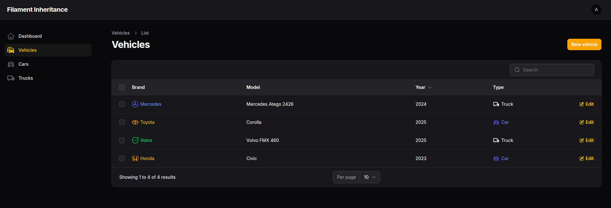
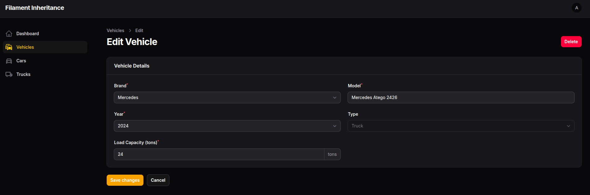
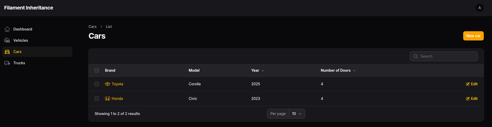
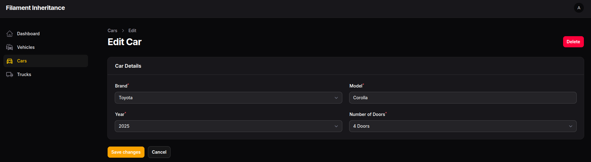
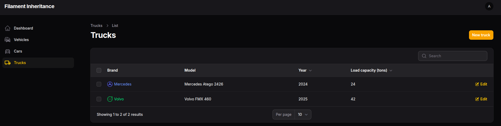
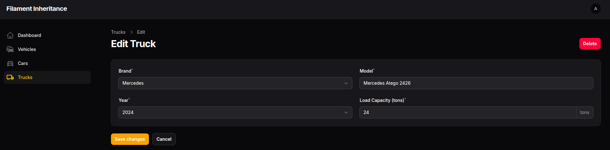

# 🚗 Projeto de Exemplo: Herança com Laravel e Filament

Este repositório demonstra, de forma simples e prática, a implementação do conceito de **herança** em um projeto Laravel, utilizando o exemplo de **veículos** como ponto de partida para representar especializações como **carros** e **caminhões**.

O objetivo principal é **ensinar e exemplificar boas práticas** no uso do Filament para modelagem de relacionamentos entre classes com herança, respeitando a estrutura das migrations, models e enumerações (Enums).

---

## 🛠️ Tecnologias utilizadas

- PHP 8.4
- Laravel 11
- Filament V3
- Eloquent ORM
- Enums (PHP 8.1+)
- MySQL
- Composer
- Docker

---

## 📦 Estrutura do projeto

- `Vehicle`: Classe base com atributos comuns (marca, modelo, ano)
- `Car` e `Truck`: Classes que se relacionam com `Vehicle` como extensões especializadas
- Enum `Brand`: Representa fabricantes de veículos
- Enum `VehicleType`: Tipos de veículos (carro, caminhão)
- Atributo `type`: Dinâmico, calculado com base no relacionamento (não salvo em banco)
- Seeder com exemplos reais de marcas, modelos e capacidade de carga

---

## 🎯 Objetivos

- Demonstrar herança na prática usando Filament
- Servir como base para estudos de orientação a objetos no contexto web
- Exibir técnicas modernas como:
  - Casts automáticos com Enums
  - Atributos computados com `Attribute::make`
  - Relacionamentos 1:1 para especializações
- Compartilhar conhecimento com a comunidade PHP/Laravel/Filament

---

## 🧪 Como rodar o projeto

1. Clone o repositório:

   ```bash
   git clone https://github.com/ivanmendanha/filament-inheritance.git
   cd filament-inheritance
   docker-compose up -d
   docker-compose exec app bash
   composer install
   php artisan migrate

## 📷 Imagens do Projeto

1. Vehicle list




2. Vehicle creation and editing



3. Car List - cars only



4. Creating and editing cars



5. Truck List - trucks only



6. Creating and editing trucks


